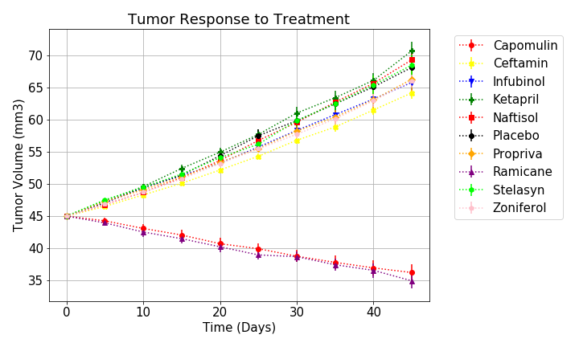
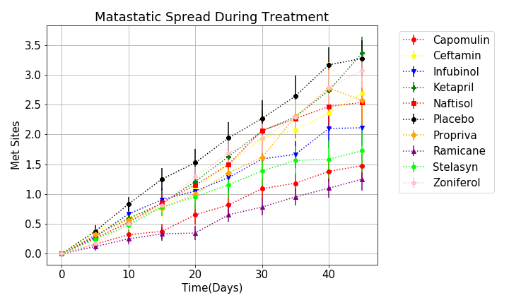
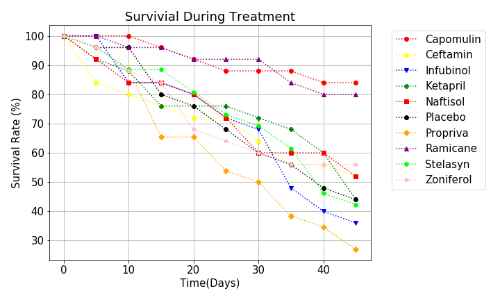

# matplotlib_project
Analysis for experimental results in which mice were treated with 9 differents drugs (Capomulin, Ceftamin, Infubinol, Ketapril, Naftisol , Propriva, Ramicane, Stelasyn, Zoniferol) and Placebo. The tumor volume and metastatic sites were recorded every five days for each mouse which survived during the 45-day treatment.

* Files
  * Pymaceutucals: the main folder
     * pymaceutical.ipynb: the main program for analyzing the experimental data
     * data : the data folder
        * clinicaltrial_data.csv: data which include mouse ID, timepoint the tumor volume, and metastatic sites 
        * mouse_drug_data: data which include mouse ID and drug
     * images: images from the results of data analysis
        * Tumor_responses_to_treatment.png: a plot showing the tumor volume for mice during the 45-day treatment for each drug
        * Metastatic_spread_during_treatment.png: a plot showing the spreading of metastatic sites during the 45-day treatment for each drug.
        * mouse_survival_during_treatment.png: a plot showing the mouse survival rate during the 45-day treatment for each drug.
        * Tumor_change_during_treatment.png: a bar plot showing the tumor change in percentage during the 45-day treatment for each drug

# Analysis

* Tumor Response to Treatment
  * Mice were treated with different drugs (including a placebo) for 45 days. Tumor volume (in mm3) were recored every 5 days
  * The plot showed the mean tumor volume and standard error for each group of experiment.
  * The data are divided into two groups, with tumor volumes decreasing during the treatemnt in one group (treated iwth Capomulin or Ramicane), and tumor volumes increasing during the treatemnt in another group (treated with Ceftmin, Inbubinol, Ketapril, Naftisol, Propriva, Stelasyn, Zoniferol, or Placebo)

* Metastatic Spreading During Treatment
  * Mice were treated with different drugs (including the placebo) for 45 days. Number of metstatic sites was recored every 5 days
  * The plot showed the mean metastatic sites and standard error for each group of experiment.
  * Metastatic sites were increasing for all drug treatments. Mice treated with Capomulin and Ramicane, which were observed with total tumor volume decreasing, also had lease metastatic sites.
  * Mice treated with Ketapril, which were observed with the most tumor volume increasing among all the treatments, had more metastatic sites than mice with any other treatment (including the Placebo) after 45 days.

  

* Survival Rate
  * Mice were treated with different drugs (including the placebo) for 45 days. 25 mice were used at the beginning of the experiment for each treatment. 
  * The plot showed the survial rate for each group of mice
  * Survival rate were decreasing for all drug treatments. Mice treated with Capomulin and Ramicane had highest survival rate

 

* Tumor volume change 
  * Mice were treated with different drugs (including the placebo) for 45 days. 
  * The bar plot showed the tumor volume change in percentage for each treatment
 * Tumor Volume was decreading in mice treated with Capomulin or Ramicane, and increasing in mice treated with Ceftmin, Inbubinol, Ketapril, Naftisol, Propriva, Stelasyn, Zoniferol, or Placebo 

* Summary
  * Mice treated with Capomulin or Ramicane showed decreasing in tumor volume, relative fewer metastatic sites and higher survial rate among all the treatment. 
  * It is recommended to take Capomulin and Ramicane for further anti-tumor tests. 

